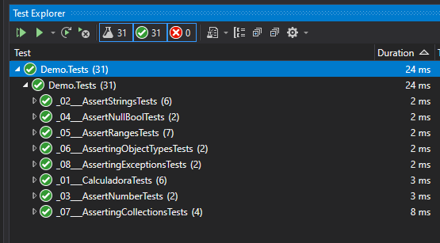
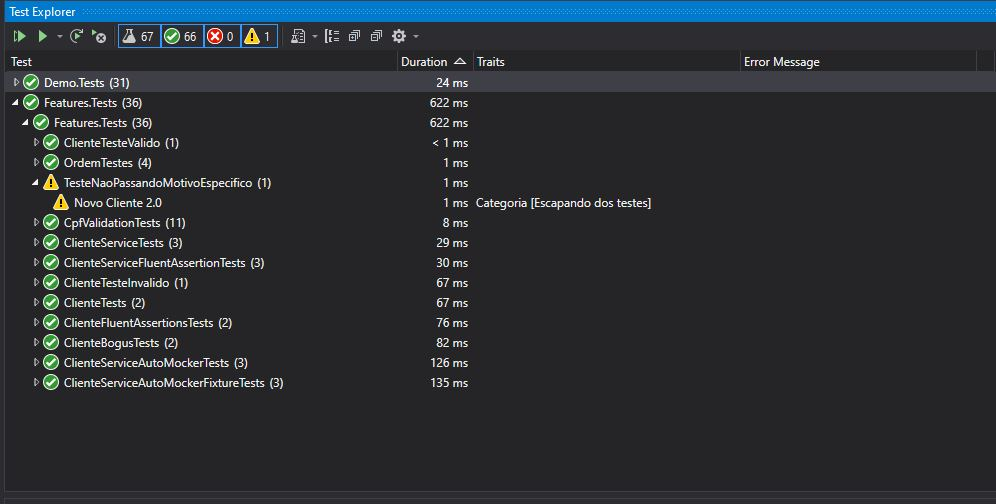
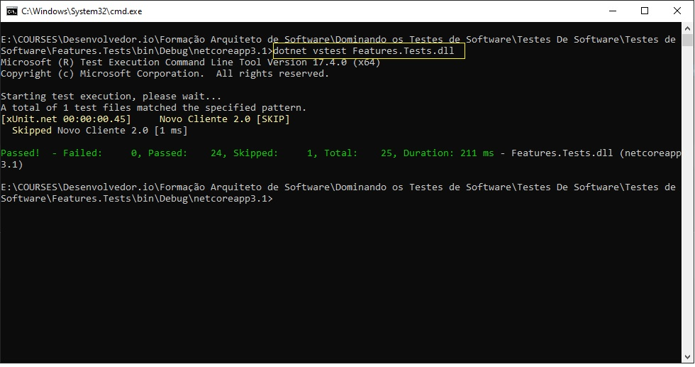

# Class Library e xUnit Test usada como exemplo na construção de testes unitários

Baseado no curso Dominando os Testes de Software, Dominando os Testes de Software.

.NET Core 3.1.

## Pré requisitos

1. [Visual Studio 2019](https://visualstudio.microsoft.com/pt-br/vs/)

## Como baixar o código

git clone https://github.com/JucelioAmaral/Testes-De-Software.git

## Como configurar?

1. N/A.

## Como executar a aplicação?

1. Abrir a Visual Studio;
2. Executar cada ou todos testes unitários.

## Testes escritos

Testes básicos:

Testes usando: Bogus, MOQ (Mock), AutoMock, FluentAssertions e Skip:

Comando para testes pelo CMD:

